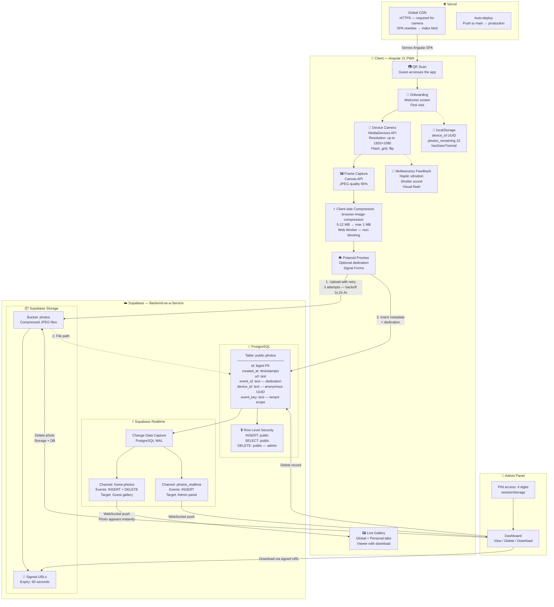
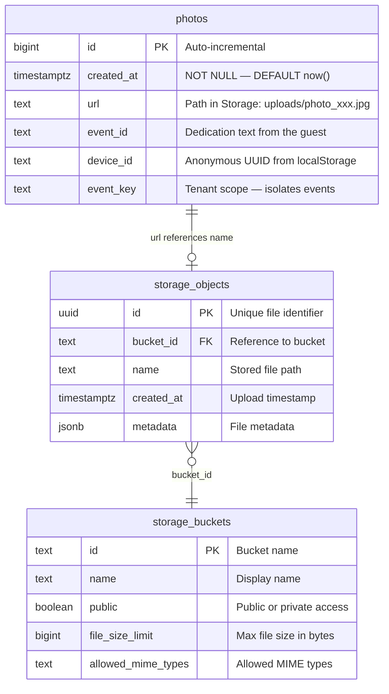

# 📸 Lumen

**Zero-friction collaborative photo gallery for social events — scan a QR, shoot, share. No app install, no signup, no quality loss.**

[](https://lumen-umber.vercel.app)


## 🌱 Origin

Lumen started as a wedding gift.

When my cousin got married, I wanted to give him something that 
would last — not a physical present that ends up in a drawer, 
but something built. The problem was obvious on the day: 200+ 
guests with cameras in their pockets, no way to pool those photos 
without WhatsApp destroying the quality or half the group being 
locked out of an iCloud album.

So I built it. One event, one QR code on each table, and by the 
end of the night there were hundreds of photos in a shared gallery 
that everyone — regardless of phone brand or technical ability — 
had contributed to.

That validation in a real, uncontrolled environment is what shaped 
every architectural decision in this codebase: the fallback camera 
constraints for older devices, the exponential backoff for crowded 
WiFi, the in-app browser detection for guests who opened the link 
from WhatsApp. Every edge case was a real guest at a real wedding.

## 🎬 Demo

**Live:** [lumen-umber.vercel.app](https://lumen-umber.vercel.app)

Lumen supports two access modes via the URL:

- **Default** (`/`) → Opens a public demo gallery with an empty event scope (`demo`). Guests can capture, upload, and browse photos freely.
- **Event-scoped** (`/?e=<event_key>`) → Loads a private gallery isolated to a specific event. All queries, uploads, and real-time subscriptions are filtered by `event_key`.

The platform was deployed and validated in a real social event with real users — guests accessed the app via a printed QR code at the venue, took photos, and browsed the shared gallery in real time from their own devices.

---

## ❓ The Problem

- **WhatsApp** destroys image quality through aggressive JPEG recompression — photos arrive at ~100 KB regardless of original resolution
- **iCloud Shared Albums** lock out non-Apple users entirely, fragmenting the guest experience
- **Professional photographers** deliver final edits in 6–12 weeks — too late for the social moment

---

## ✅ Solution

Lumen replaces all three with a single PWA flow: **QR → browser → capture → shared gallery**. No app store, no account creation, no waiting.

- **Multi-tenant isolation** — each event gets its own `event_key` scope; guests never see photos from other events
- **Client-side compression** — photos are compressed in a Web Worker before upload (5–12 MB → <1 MB), preserving resolution without blocking the UI thread
- **Real-time gallery** — new photos appear instantly via WebSocket CDC (Supabase Realtime on PostgreSQL WAL)
- **Sustainability** — replaces disposable cameras and single-use photo apps at events (aligned with SDG 12: Responsible Consumption)

---

## 🏗️ Architecture



**3-layer architecture:**

1. **Presentation** — Angular 21 standalone components with Signals for reactive state. Four feature modules (`onboarding`, `home`, `camera`, `admin`) loaded eagerly via the Angular Router.
2. **Services** — 4 singleton services (`SupabaseService`, `FeedbackService`, `PhotoLimitService`, `GlobalErrorHandlerService`) injected via `providedIn: 'root'`. All Supabase interaction is centralized in `SupabaseService`.
3. **Infrastructure** — Supabase (PostgreSQL + Storage + Realtime) for the backend; Vercel for static hosting with SPA rewrites and global CDN.

---

## 🛠️ Tech Stack

| Layer | Technology | Why |
|---|---|---|
| Framework | Angular 21 (Signals, standalone components) | Signal-based reactivity eliminates `zone.js` overhead; standalone components remove `NgModule` boilerplate |
| Language | TypeScript 5.9 (`strict: true`, `strictTemplates: true`) | Catches null reference and template binding errors at compile time, not at runtime |
| Backend | Supabase (PostgreSQL + RLS + Realtime CDC) | Row Level Security enforces access at the DB level; Realtime uses PostgreSQL WAL for zero-polling live updates |
| Hosting | Vercel | Auto-deploy on push to `main`; global CDN with mandatory HTTPS (required for `MediaDevices` API) |
| Compression | `browser-image-compression` 2.x | Offloads JPEG compression to a Web Worker thread — UI stays responsive during 5–12 MB → <1 MB reduction |
| Testing (Unit) | Vitest 4.x | Faster cold-start than Karma/Jasmine; compatible with Angular's `TestBed` via `jsdom` |
| Testing (E2E) | TestSprite + Playwright (Python) | AI-generated test scripts from a standardized PRD; 12 test cases covering onboarding, gallery, and admin flows |
| Styling | Tailwind CSS 3.4 + SCSS | Utility classes for rapid layout; SCSS for component-scoped styles with nesting |
| Forms | `@angular/forms/signals` (Signal Forms) | Type-safe reactive forms using Angular's experimental Signal Forms API |

---

## 🔑 Key Engineering Decisions

### Multi-tenant isolation via `event_key`

The `event_key` parameter flows through the system as: `URL ?e= param → localStorage → 'demo' fallback`. This is resolved once in `SupabaseService.initEventKey()` and cached in memory. Every query (`fetchAllPhotos`, `fetchMyPhotos`, `fetchPhotos`) and every Realtime subscription (`subscribeToPhotos`, `subscribeToAllPhotos`) filters by `event_key`.

**Tradeoff:** No server-side session management — a guest who manually edits `localStorage` could access another event's photos. Acceptable for a social photo gallery where photos are inherently public to event attendees.

### Anonymous identity via UUID v4 in `localStorage`

`SupabaseService.getDeviceId()` generates a `crypto.randomUUID()` (with a manual fallback for older browsers) and stores it in `localStorage` under `lumen_device_id`. This UUID is sent as `device_id` on every photo insert and used client-side to determine ownership (show/hide delete button).

**Tradeoff:** No authentication = no friction for event guests. Ownership is enforced at the UI layer, not at the DB level — a determined user could craft a Supabase request with a different `device_id`. For the use case (social event photos, not private documents), this is an acceptable risk.

### Camera constraint fallback cascade

```
1920×1080 → OverconstrainedError → 1280×720 → OverconstrainedError → unconstrained
```

Implemented in `CameraComponent.startCamera()` with nested `try/catch` blocks. The cascade handles iOS 14+ devices where `ideal` constraints on resolution are rejected as `OverconstrainedError` instead of being treated as hints.

**Tradeoff:** Older devices get lower resolution, but the camera always opens. Without this cascade, the entire camera flow would fail silently on ~15% of iOS devices.

### Client-side compression via Web Worker

`browser-image-compression` runs JPEG compression in a Web Worker thread. Configuration: `maxSizeMB: 1`, `maxWidthOrHeight: 1920`, `useWebWorker: true`. Progress is reported via the `onProgress` callback and mapped to the first 50% of the upload progress bar.

**Tradeoff:** Adds ~150 KB to the bundle. But without it, uploading a 12 MB iPhone photo over event WiFi would take 30–60 seconds. With compression, the upload payload is consistently <1 MB.

### Exponential backoff retry (1s → 2s → 4s)

`uploadPhotoWithRetry()` and `savePhotoDataWithRetry()` implement 3-attempt retry with `[1000, 2000, 4000]` ms delays. A callback notifies the UI on each retry so the user sees "Connection weak. Retrying (2/3)..." instead of a spinner.

**Tradeoff:** Total worst-case wait is 7 seconds before failure. Designed for shared WiFi at events (100+ guests on one access point) where transient failures are common.

### In-app browser detection in `AppComponent`

`AppComponent.ngOnInit()` checks the User-Agent for `WhatsApp`, `Instagram`, `FBAN`, and `FBAV` strings. If detected, a fixed warning banner instructs the user to open the link in Safari or Chrome.

**Tradeoff:** User-Agent sniffing is fragile. But the alternative — waiting for `getUserMedia` to fail inside the camera flow — gives no actionable guidance. The root-level check catches the problem before the user invests time in the onboarding flow.

### `sessionStorage` for admin auth

The admin PIN is validated client-side and the auth flag is stored in `sessionStorage` under `lumen_admin_auth`. This means the session expires when the browser tab is closed — no persistent token, no cookie, no JWT.

**Tradeoff:** The PIN is hardcoded in the component (`ADMIN_PIN = '2102'`). This is not production-grade auth — it's a lightweight gate for event organizers who need to moderate photos during an event. A future iteration would use Supabase Auth with RLS policies tied to authenticated roles.

---

## 🗄️ Database Schema



The schema follows a minimal, portable design: one application table (`photos`) plus Supabase-managed storage tables. The `photos` table holds only metadata — actual files live in Supabase Storage. The `event_key` column enables multi-tenant scoping at the query level. RLS is enabled at the database level so that even direct API calls respect access rules.

**RLS policies on `public.photos`:**

```sql
ALTER TABLE public.photos ENABLE ROW LEVEL SECURITY;

-- Anyone can insert (guests upload without auth)
CREATE POLICY "Permitir insercion publica"
  ON public.photos FOR INSERT
  WITH CHECK (true);

-- Anyone can read (shared gallery)
CREATE POLICY "Permitir lectura publica"
  ON public.photos FOR SELECT
  USING (true);

-- Full access policy (admin operations)
CREATE POLICY "Acceso Total Tabla"
  ON public.photos
  USING (true) WITH CHECK (true);
```

---

## 🧪 Testing

### Unit Tests (Vitest)

| Spec file | Validates |
|---|---|
| `app.spec.ts` | Root `AppComponent` instantiation and initial render |
| `supabase.spec.ts` | `SupabaseService` injection and singleton creation |
| `camera.spec.ts` | `CameraComponent` instantiation and initial state |

### E2E Suite (TestSprite + Playwright/Python)

| ID | Area | Description | Status |
|---|---|---|---|
| TC001 | Onboarding | Splash screen renders branding and illustration on initial load | ✅ Pass |
| TC002 | Onboarding | Manual entry navigates to Home and cancels auto-timer | ✅ Pass |
| TC003 | Onboarding | Entry succeeds when Device ID generation is slow | ✅ Pass |
| TC004 | Onboarding | Repeated quick taps on Enter Gallery don't cause errors | ✅ Pass |
| TC005 | Gallery | Global → Personal tab switch filters by Device ID | ✅ Pass |
| TC006 | Gallery | Open photo shows full-screen modal with caption and actions | ✅ Pass |
| TC007 | Gallery | Close full photo modal returns to gallery | ✅ Pass |
| TC008 | Gallery | Delete owned photo with confirmation removes it | ✅ Pass |
| TC009 | Gallery | Cancel delete keeps the photo in the gallery | ✅ Pass |
| TC010 | Admin | Authenticated admin can access Admin view | ✅ Pass |
| TC011 | Admin | Admin can delete a photo from the admin list | ✅ Pass |
| TC012 | Admin | Admin delete confirmation can be canceled | ✅ Pass |

All 12 test cases pass on the production build.

---

## 📁 Project Structure

```
Lumen/
├── diagrama_arquitectura.mmd   # Mermaid architecture diagram
├── diagrama_er.mmd             # Mermaid ER diagram
├── lumen_backup.sql            # Full database backup with RLS policies
├── lumen_dbdiagram.sql         # Portable schema definition
└── web/
    ├── angular.json            # Angular CLI workspace config
    ├── package.json            # Dependencies and scripts
    ├── tailwind.config.js      # Tailwind CSS configuration
    ├── tsconfig.json           # TypeScript strict mode config
    ├── vercel.json             # Vercel SPA rewrites
    ├── src/
    │   ├── index.html          # SPA entry point
    │   ├── main.ts             # Angular bootstrap
    │   ├── styles.scss         # Global styles
    │   ├── environments/
    │   │   ├── environment.ts            # Production config
    │   │   └── environment.development.ts # Dev config (Supabase keys)
    │   └── app/
    │       ├── app.ts          # Root component — in-app browser detection
    │       ├── app.routes.ts   # Route definitions (4 routes + wildcard)
    │       ├── app.config.ts   # Provider config (Router, ErrorHandler)
    │       ├── core/
    │       │   └── services/
    │       │       ├── supabase.ts             # Supabase client, CRUD, retry, realtime
    │       │       ├── feedback.service.ts      # Haptic, audio, visual feedback
    │       │       ├── photo-limit.service.ts   # 10-photo cap with localStorage persistence
    │       │       └── global-error-handler.ts  # Crash recovery UI (prevents white screen)
    │       └── features/
    │           ├── onboarding/  # Splash screen + first-visit routing
    │           ├── home/        # Live gallery with Global/Personal tabs
    │           ├── camera/      # MediaDevices capture, compression, upload
    │           └── admin/       # PIN-gated dashboard with realtime feed
    └── testsprite_tests/
        ├── TC001–TC012*.py     # 12 Playwright E2E test scripts
        ├── testsprite_frontend_test_plan.json  # Test plan definition
        └── testsprite-mcp-test-report.md       # Test execution report
```

---

## 🚀 Getting Started

**Prerequisites:** Node 18+, npm 10+, a [Supabase](https://supabase.com) project

```bash
# 1. Clone
git clone https://github.com/<your-username>/Lumen.git && cd Lumen/web

# 2. Install dependencies
npm install

# 3. Configure environment
# Edit src/environments/environment.development.ts with your Supabase URL and anon key

# 4. Run locally
ng serve
```

**Database migration** — add the `event_key` column to enable multi-tenant scoping:

```sql
-- Add event_key column for multi-tenant isolation
ALTER TABLE public.photos
  ADD COLUMN event_key text DEFAULT 'demo';

-- Backfill existing rows
UPDATE public.photos
  SET event_key = 'demo'
  WHERE event_key IS NULL;

-- Index for fast filtered queries
CREATE INDEX idx_photos_event_key
  ON public.photos (event_key);
```

---

## 🗺️ Roadmap

- **Native wrapper** (Capacitor/React Native) — enable push notifications for new photos and background uploads
- **AI-powered photo curation** — auto-detect duplicates, blur, and low-quality shots; surface highlights (similar to [Capsule](https://capsule.com))
- **Multi-event admin dashboard** — venue operators managing multiple concurrent events from a single interface
- **Frame/watermark customization** — per-event branding overlays (date, event name, custom frame) applied client-side before upload
- **End-to-end encryption** — optional E2EE for private events where photos should not be readable by the platform operator

---

## 📄 License

MIT
