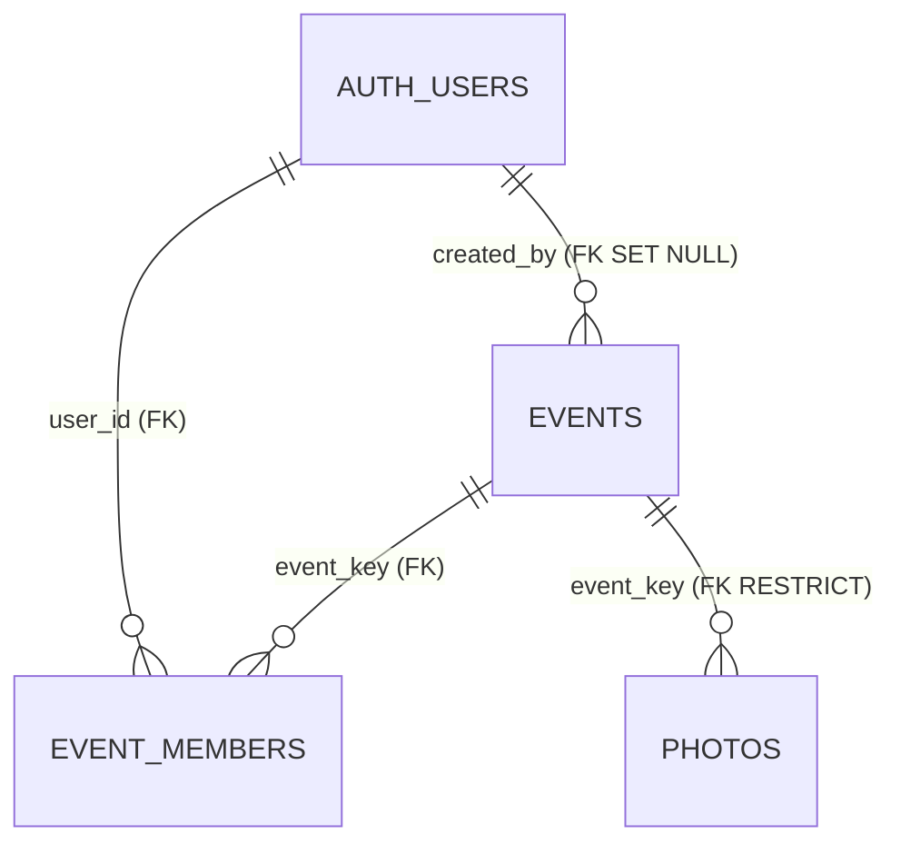

# Evidencias para la memoria de Lumen

Revisión auditada: `4284e8f977e832ab5479cccca8500d3bc01bc755` (`main`, 2026-08-05). Fecha de revisión: 2026-09-07, Europe/Madrid. Etiquetas: **[C]** comprobado en código; **[E]** comprobado mediante ejecución local; **[D]** solo declarado/documentado; **[N]** no encontrado. Salvo revisión expresa, las rutas y líneas se refieren a `4284e8f`.

## Resumen (menos de 1.200 palabras)

### 1. Cobertura y pruebas

- **[E]** El resultado defendible de cobertura global es **4,39 % sentencias (40/910), 6,68 % ramas (21/314), 3,04 % funciones (6/197) y 4,31 % líneas (36/834)**. `ng test --coverage --watch=false` pasó 29/29 pruebas, pero terminó con código 1 al incumplir los umbrales 12/21/11/12. La ejecución directa de Vitest dio 100 % (55/55, 21/21, 6/6, 51/51), únicamente sobre cuatro módulos importados; no es cobertura global. Comandos, fechas y salida: `evidencias_vitest_2026-09-07.txt`. Inclusión/exclusión: `web/angular.json:76-113`; specs: `web/src/app/core/utils/{capture,download,retry}.spec.ts`; configuración directa: `web/vitest.config.ts:4-17`. Revisión de configuración: `2f010813`; Vitest actual: `4284e8f`.
- **[N]** No se hallaron 91,45/86,12/88,54/92,15, ni 90,72 o 7/9, en código, historial o informes. No deben reutilizarse. El JSON ignorado `web/coverage/coverage-final.json` (mtime 2026-08-06, sin comando/revisión embebidos) también da 100 % de esos cuatro módulos.
- **[C/D]** Hay 34 planes/scripts Playwright, pero el validador agregado ejecuta solo 26, en Chromium headless 1280×720, timeout 15 s; no registra duración por caso, versión del navegador ni reintentos (`web/testsprite_tests/validate_plan.py:795-887`, revisión `4f71dd00`). No se ejecutó: apunta al despliegue y TC011 puede borrar (`:843-847`). El HTML TestSprite versionado es una plantilla/resumen **0/0**, no una salida de 26 casos (`testsprite-mcp-test-report.html:1237-1243,1309,1338`, revisión `d32f29d9`). No hay informe Lighthouse ni configuración/informe Playwright estándar. Las capturas/métricas de esas herramientas no son contrastables aquí.

### 2. Identidad y autorización

- **[C]** El QR aporta `?e=`: se valida con `^[a-z0-9][a-z0-9-]{1,38}[a-z0-9]$`, se prioriza sobre una clave válida de `localStorage`, y si falta se usa `demo` (`SessionService.initEventKey`, `web/src/app/core/services/session.service.ts:111-132`; revisión `78610408`). `device_id` es UUID persistente por navegador (`getDeviceId`, `:85-109`).
- **[C/D]** Bootstrap consulta sesión y sí llama `signInAnonymously()` si no existe; después inserta/upserta `(auth.uid(), event_key)` (`ensureAuthSession/ensureMembership`, `session.service.ts:44-67,134-171`; `app.config.ts:20-28`; revisiones `8c4c3322/4284e8f`). Bajo el esquema 008/012–015, un evento inexistente falla por FK; el error se registra, `membershipReady` queda falso y la galería queda vacía por RLS, sin pantalla explícita de “evento inexistente”. El `upsert` en conflicto pretende ser idempotente, pero 012 no concede ni crea política UPDATE; una revisita puede registrar error aunque la pertenencia ya existente siga autorizando lecturas (`session.service.ts:139-167`; `012:20-24,125-130`).
- **[C/D]** Si se aplicaron 012–015: `event_members` permite SELECT propio e INSERT de uno mismo, sin UPDATE/DELETE (`012:18-24,39-42,106-130`); `photos` permite SELECT de eventos devueltos por `get_my_event_keys`, INSERT con `owner_id=auth.uid()` y pertenencia, DELETE solo si `owner_id=auth.uid()`, sin UPDATE (`013:24-41`; `014:15-31,52-54`; `015:13-18`). La función es `SECURITY DEFINER`, estable y concedida a `authenticated` (`008:28-40`). Es **solo declarado respecto al despliegue**: las migraciones son manuales (`migrations/README.md:5-12`).
- **[C]** El PIN está incrustado y comparado enteramente en el cliente; solo activa una bandera de `sessionStorage` (`AdminComponent.checkPin/ngOnInit`, `admin.ts:35-68`). No es credencial de Supabase y puede eludirse. La autorización real de Postgres es el JWT anónimo, la pertenencia y `owner_id`; `/admin` no tiene rol especial y tras 015 no puede borrar **la fila** de otro usuario (`013:58-61`; `015:31-37`). Como el código intenta borrar antes el objeto, una política Storage permisiva aún podría permitir destruir el archivo y dejar la fila rota; la política desplegada no consta (`supabase.service.ts:143-160`).

### 3. Esquema y archivos

- **[C/D]** No existe un volcado local completo: 001–015 parten de `photos/events` preexistentes. Por eso no se genera `schema_lumen.sql` ni se afirma que las migraciones estén desplegadas. Lo acreditable está en el Anexo A. El DDL `web/docs/lumen_dbdiagram.sql:1-32` (revisión `cdc94807`) está incompleto/desactualizado: no contiene `events`, `event_members` ni `photos.owner_id`.
- **[C]** La app espera bucket `photos`; sube a `uploads/photo_<Date.now()>.jpg`, usa URL pública para galería y URL firmada de 60 s para descarga admin (`constants.ts:28-35`; `camera.ts:427-454`; `SupabaseService.getPhotoPublicUrl/getPhotoDownloadUrl`, `supabase.service.ts:163-177,223-232`). **[N]** No hay migraciones de bucket ni políticas `storage.objects`; que el código use URL pública no prueba que el bucket desplegado sea público.
- **[C]** Subida: comprime → sube objeto (hasta 3 intentos) → inserta fila (hasta 3) → descuenta cuota (`camera.ts:401-483`). Si falla la fila queda un objeto huérfano; no hay compensación. Un retry manual crea otra ruta y puede duplicar objetos. La ruta no incluye evento/dispositivo y `Date.now()` admite colisiones. Borrado: objeto primero, fila después (`supabase.service.ts:143-160`); si falla la fila queda un registro roto. No hay transacción entre Storage y Postgres.

### 4. PWA, versiones, cámara y cuota

- **[C]** Lockfile: Angular core/CLI/build **21.1.2**, Supabase JS **2.93.3**, Vitest **4.1.9**, TypeScript **5.9.3**, compresión **2.0.2** (`package-lock.json:346,446,543,3995,4615,9123,9339`; revisión `4284e8f`). Gestor declarado: npm **10.8.2** (`package.json:26`); ejecución observada: Node 26.0.0/npm 11.12.1. **[N]** No hay versión Node fijada por proyecto. Tampoco manifiesto, `ngsw-config`, paquete/registro de service worker ni cola persistente: “PWA” no se puede defender técnicamente. El blob pendiente vive solo en una señal (`camera.ts:65-74,476-490`).
- **[C]** Cámara: `facingMode` simple y resolución ideal 1920×1080, fallback ideal 1280×720 y luego genérico ante `OverconstrainedError`; no usa `{exact:...}` (`camera.ts:145-199`). Trata permiso denegado/no cámara/genérico (`:214-227`), cambia cámara reiniciando stream (`:239-270`), intenta torch y conserva flash de pantalla como alternativa (`:280-311,321-365`). Hay selector de archivo JPEG/PNG (`home.html:115`; `home.ts:200-219`). Compresión: ≤1 MB, dimensión ≤1920, Worker (`camera.ts:412-423`).
- **[C]** Son 3 intentos totales por fase y solo esperas 1 s y 2 s; el 4 s configurado no se usa con tres intentos. Toda excepción o `{error}` se reintenta, sin clasificar códigos (`constants.ts:24-26`; `retry.ts:37-80`). La cuota baja solo tras objeto+fila y sube tras borrado completo (`camera.ts:446-467`; `home.ts:309-327`). Es una única clave local, no separada por evento, manipulable y sin control servidor; `events.photo_limit` no se consulta (`photo-limit.service.ts:27-95`; `constants.ts:11,20-22`; `005:22-26`).

### 5. Despliegue, refactor y sistema

- **[C]** Scripts: serve/build/watch/test, y cobertura directa (`package.json:4-11`). Producción limita bundle inicial a 700 kB warning/1 MB error y estilo por componente a 16 kB warning/error (`angular.json:41-54`). Vercel declara `dist/web/browser` y rewrite SPA global (`vercel.json:1-9`), pero la configuración desplegada no se deduce. **[N]** No hay CI; nada en el repositorio obliga a ejecutar tests antes de desplegar. **[E]** Un build local con salida en `/tmp` terminó 134; una sola ejecución no demuestra incompatibilidad general (anexo de salida).
- **[C]** Historial defendible: constantes `a161d38c`; alias `6a0132bc` (`tsconfig.json:6-10`); extracción de retry `d6c2ee16/96ade967`; `SessionService` `f4a02729`; descargas `bbb51a61`; logger `53711892`; nombres de servicios `f099c7b6`; `event_id→dedication` `8a409535`; migraciones 001–004 `cc7074a7`, 005–015 y auth/owner explícito `4284e8f`. Son cambios localizables, no una medida de calidad por líneas.
- **[D/N]** Resultado versionado: **20 PASS, 0 FAIL, 6 SKIP** (TC006, TC007, TC021, TC032, TC011, TC012), `validation_report.json` en `4f71dd00`. El worktree previo del usuario cambia a **22/0/4**, dejando TC006/007/021/032 omitidos. **23/0/3 con TC007/021/032** no aparece. Las 34 tareas del plan y las 26 del validador no son equivalentes. Sin duración, browser version o retry, y sin varias corridas comparables, no se puede afirmar estabilidad.

## Anexo A — esquema relacional acreditable y comprobación del despliegue

**[D]** Estado local reconstruible (no garantiza aplicación): `photos` documenta `id bigint PK`, `created_at timestamp NOT NULL`, `url text NOT NULL`, `dedication text NULL`, `device_id text NOT NULL`, `event_key text NOT NULL DEFAULT 'demo'` (`docs/lumen_dbdiagram.sql:1-8`); 007 añade FK a `events(event_key)` ON DELETE RESTRICT; 009 añade `owner_id uuid NULL DEFAULT auth.uid()` sin FK. Índices: `(event_key, created_at DESC)` y `(device_id,event_key)` (`003:6-17`). `events`: PK `event_key`; 005 añade `brand_color text`, `banner_url text`, `photo_limit int NOT NULL DEFAULT 10`, `created_by uuid → auth.users ON DELETE SET NULL` y CHECK de formato (`005:12-34`); el tipo exacto de las columnas base `name/event_date` no está creado localmente. `event_members` sí está definido por completo: `user_id uuid → auth.users CASCADE`, `event_key text → events CASCADE`, PK compuesta e índice inverso (`008:17-26`).



`photos.owner_id` se omite como relación porque no tiene FK declarada. `photos.url` tampoco es FK a Storage.

Consulta de solo lectura para Supabase SQL Editor (ejecutar como operador; no devuelve filas de negocio):

```sql
select table_schema, table_name, column_name, data_type, is_nullable, column_default
from information_schema.columns
where table_schema in ('public','storage')
  and table_name in ('events','photos','event_members','buckets','objects')
order by table_schema, table_name, ordinal_position;

select n.nspname schema_name, c.relname table_name, con.conname,
       pg_get_constraintdef(con.oid) definition
from pg_constraint con join pg_class c on c.oid=con.conrelid
join pg_namespace n on n.oid=c.relnamespace
where n.nspname='public' and c.relname in ('events','photos','event_members');

select schemaname, tablename, indexname, indexdef from pg_indexes
where schemaname='public' and tablename in ('events','photos','event_members');

select schemaname, tablename, policyname, cmd, roles, qual, with_check
from pg_policies where (schemaname='public' and tablename in ('events','photos','event_members'))
or (schemaname='storage' and tablename='objects');

select n.nspname schema_name, c.relname table_name, c.relrowsecurity
from pg_class c join pg_namespace n on n.oid=c.relnamespace
where (n.nspname='public' and c.relname in ('events','photos','event_members'))
or (n.nspname='storage' and c.relname='objects');

select id, name, public, file_size_limit, allowed_mime_types
from storage.buckets where id='photos';
```

Confirmar además en Supabase → Authentication → Sign In / Providers que Anonymous está habilitado. En Vercel: Project → Settings → Build and Deployment (root/output/build) y Deployments → commit del despliegue; registrar solo nombres de variables, nunca valores.

## Anexo B — contraste final

| Afirmación de la memoria | Evidencia real | Redacción que se puede defender |
|---|---|---|
| Cobertura 91,45/86,12/88,54/92,15 | **[N/E]** No aparece; global actual 4,39/6,68/3,04/4,31 | “29 unit tests pass; global coverage remains low and fails thresholds.” |
| 26 casos: 23 pasan, 3 omitidos | **[N/D]** Git: 20/0/6; worktree: 22/0/4 | “Hay un validador de 26 casos; sus resultados conservados no acreditan 23/3.” |
| Acceso por QR seguro | **[C]** Clave válida + auth anónima + membership; cualquier conocedor de una clave existente puede unirse | “Aislamiento por pertenencia basada en posesión de event_key, si RLS 012–015 está desplegado.” |
| PIN autoriza administración | **[C]** Solo UI/sessionStorage; misma identidad anónima | “El PIN oculta la interfaz; RLS/JWT autoriza los datos y no existe rol admin.” |
| Bucket privado/PWA/cola offline | **[N]** URL pública esperada; sin manifiesto, SW ni cola | “No acreditado; hay reintentos en memoria durante la sesión.” |
| Cuota por evento y en servidor | **[C/N]** contador local global; columna `photo_limit` no usada | “Límite UX por navegador, no control autoritativo.” |
| Tests bloquean despliegue | **[N]** sin CI; cobertura amplia sale 1 | “No existe puerta de calidad versionada para el despliegue.” |
