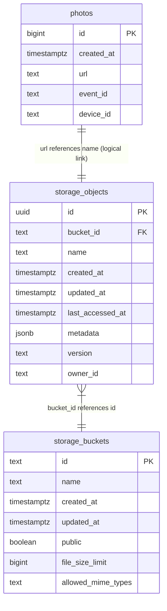

# Informe Técnico de Desarrollo e Implementación — Proyecto "Lumen"
## Documentación Técnica Exhaustiva para Trabajo de Fin de Grado (TFG)

Este documento proporciona una radiografía técnica completa y detallada del repositorio **Lumen**, una aplicación web móvil-first de tipo PWA orientada al intercambio de fotos en tiempo real para eventos de bodas (específicamente la boda de Natacha y Lucas el 21 de Febrero de 2026). El sistema está construido con **Angular 21** en el frontend, **Tailwind CSS** para los estilos estéticos, y **Supabase** (PostgreSQL + Storage + Realtime CDC) en el backend, desplegado en la plataforma **Vercel**.

---

## 1. Estructura del Proyecto y Propósito

A continuación se muestra el árbol completo de directorios del proyecto (excluyendo carpetas de compilación y dependencias como `node_modules`, `dist` y `.angular`).

### Árbol de Directorios Completo

```
Lumen/
├── diagrama_arquitectura.mmd                # Diagrama de flujo/arquitectura en formato Mermaid
├── diagrama_er.mmd                          # Diagrama Entidad-Relación en formato Mermaid
├── lumen_dbdiagram.sql                      # Definición DDL compatible con DBdiagram.io
└── web/                                     # Aplicación Angular 21 (Frontend)
    ├── .browserslistrc                       # Targets de navegadores soportados (iOS >= 14, etc.)
    ├── .editorconfig                         # Configuración de formateo para el IDE
    ├── README.md                            # Documento de bienvenida del CLI de Angular
    ├── angular.json                         # Configuración del espacio de trabajo y compilación de Angular
    ├── knip.json                            # Configuración de Knip para detectar código y CSS huérfano
    ├── package.json                         # Gestión de dependencias npm y scripts de desarrollo/compilación
    ├── tailwind.config.js                  # Configuración de temas, fuentes y estilos de Tailwind CSS
    ├── tsconfig.json                       # Configuración base de TypeScript (incluye path aliases @core, @features, @environments)
    ├── tsconfig.app.json                   # Configuración de compilación específica para la aplicación
    ├── tsconfig.spec.json                  # Configuración de TypeScript para la suite de testing
    ├── vercel.json                         # Reglas de enrutamiento y rewrite SPA para Vercel
    ├── .vscode/                             # Ajustes, tareas y extensiones sugeridas para VS Code
    │   ├── extensions.json
    │   ├── launch.json
    │   ├── mcp.json
    │   ├── settings.json
    │   └── tasks.json
    ├── docs/                                # Documentación de arquitectura y guías operativas
    │   ├── SUPABASE_ADMIN_SETUP.md          # Manual para configurar RLS en Supabase
    │   └── INFORME_TECNICO_TFG.md          # Este documento: informe técnico exhaustivo del TFG
    ├── public/                              # Recursos estáticos servidos directamente
    │   ├── dibujo.png                      # Ilustración de acuarela (portada del onboarding)
    │   ├── favicon.ico                     # Icono de la barra del navegador
    │   └── assets/                          # Fuentes tipográficas y assets locales
    │       ├── fonts/
    │       │   ├── Aniyah.ttf              # Fuente script/caligráfica elegante
    │       │   └── TheSeasons.ttf          # Fuente serif moderna editorial
    │       └── frames/                     # Carpeta destinada a marcos fotográficos locales
    ├── scripts/                             # Scripts de utilidad internos
    │   └── find_unused_css.js              # Analizador automático de clases CSS sin usar
    ├── testsprite_tests/                   # Suite de pruebas E2E automáticas
    │   ├── testsprite_frontend_test_plan.json # Plan formal de 12 casos de prueba
    │   ├── testsprite-mcp-test-report.md    # Reporte de ejecución del Test plan
    │   ├── testsprite-mcp-test-report.html  # Reporte gráfico en formato HTML
    │   ├── standard_prd.json               # Especificaciones del producto para los tests
    │   └── TC001_... a TC012_...py         # Scripts Python Playwright de cada caso de prueba
    └── src/                                 # Código fuente de la aplicación Angular
        ├── index.html                      # Punto de entrada HTML5 y carga de fuentes externas
        ├── main.ts                         # Script de inicialización y arranque de Angular (Bootstrap)
        ├── styles.scss                     # Importación y configuración de directivas globales de Tailwind
        ├── environments/                    # Variables de entorno
        │   └── environment.ts              # Variables de entorno (Supabase URL, Anon Key, flag production)
        └── app/                             # Arquitectura lógica de Angular
            ├── app.config.ts               # Proveedores globales (Router, ErrorHandler)
            ├── app.html                    # Plantilla base (contiene únicamente <router-outlet>)
            ├── app.routes.ts               # Declaración de rutas y navegación de la SPA
            ├── app.scss                    # Estilos específicos del componente base
            ├── app.ts                      # Componente base: detección de in-app browsers
            ├── core/                        # Módulos transversales y core de la app
            │   ├── constants.ts              # Constantes centralizadas (keys, límites, canales, buckets)
            │   ├── models/
            │   │   └── photo.ts             # Interfaces Photo y GalleryPhoto (modelo compartido)
            │   ├── utils/
            │   │   └── download.ts          # Utilidad de descarga de archivos via Blob (iOS-safe)
            │   └── services/                # Servicios globales singleton
            │       ├── feedback.service.ts       # Feedback multisensorial (haptics, audio, flash)
            │       ├── global-error-handler.service.ts  # Manejador global de errores del runtime
            │       ├── logger.service.ts         # Fachada de logging silenciada en producción
            │       ├── photo-limit.service.ts    # Control del límite de 10 fotos por dispositivo
            │       ├── session.service.ts        # Identidad anónima (device_id, event_key)
            │       ├── supabase.service.ts       # Cliente API de base de datos, storage y realtime
            │       └── supabase.spec.ts          # Pruebas unitarias de inyección del servicio Supabase
            └── features/                    # Módulos y vistas principales de la aplicación
                ├── admin/                   # Panel de administración protegido por PIN
                │   ├── admin.html
                │   ├── admin.scss
                │   └── admin.ts
                ├── camera/                  # Cámara nativa y flujo de captura, compresión y subida
                │   ├── camera.html
                │   ├── camera.scss
                │   ├── camera.spec.ts
                │   └── camera.ts
                ├── home/                    # Galería compartida interactiva (Global vs Personal)
                │   ├── home.html
                │   ├── home.scss
                │   └── home.ts
                └── onboarding/              # Bienvenida, tutorial e inicialización de Device ID
                    ├── onboarding.html
                    ├── onboarding.scss
                    └── onboarding.ts
```

### Propósito de las Carpetas y Archivos Clave

- **`/web/src/app/core/`**: Aloja la lógica dura de infraestructura. Incluye servicios singleton, constantes centralizadas, modelos de datos tipados y utilidades compartidas. Todos los componentes consumen el estado y los métodos expuestos aquí. Garantiza un desacoplamiento limpio de las APIs del navegador y de Supabase.
- **`/web/src/app/core/constants.ts`**: Fuente única de verdad para valores reutilizados: claves de localStorage, límites de fotos, tiempos de retry, nombres de canales realtime y nombres de buckets de almacenamiento.
- **`/web/src/app/core/models/photo.ts`**: Define las interfaces `Photo` y `GalleryPhoto` como modelo de datos compartido, eliminando la necesidad de `any` en la capa de datos.
- **`/web/src/app/core/utils/download.ts`**: Utilidad centralizada para descargas de archivos en el navegador. Resuelve los problemas de compatibilidad con Safari/iOS usando la técnica de crear un `<a>` temporal con un `Blob URL`.
- **`/web/src/app/features/`**: Contiene las pantallas autocontenidas de la aplicación mediante la aproximación *Standalone Components* de Angular. Cada feature agrupa su lógica (`.ts`), plantilla (`.html`) y estilos locales (`.scss`).
- **`diagrama_arquitectura.mmd` y `diagrama_er.mmd`**: Archivos de documentación viva basados en Mermaid que permiten renderizar visualmente el flujo de datos del sistema y el modelo relacional respectivamente.

---

## 2. Componentes y sus Responsabilidades

Lumen se divide en 4 componentes principales de tipo Standalone que implementan toda la experiencia de usuario utilizando la arquitectura reactiva basada en **Signals**.

---

### A. OnboardingComponent (`features/onboarding/`)
- **Pantalla que Representa**: Pantalla de bienvenida o Splash Screen para los usuarios que acceden por primera vez (normalmente escaneando un código QR en las mesas del banquete).
- **Signals y Estados**:
  - No utiliza Signals directas de Angular.
  - Administra un estado de tiempo implícito `autoNavTimer: ReturnType<typeof setTimeout> | null` para realizar una navegación automatizada en caso de que sea necesario, aunque prioriza la acción manual del usuario.
- **Servicios Inyectados**:
  - `Router` (Angular Router): Para redirigir al home tras la inicialización.
  - `SupabaseService`: Para inicializar y recuperar/crear el identificador del dispositivo.
- **APIs del Navegador Utilizadas**:
  - `localStorage`: Consulta la clave `hasSeenTutorial` para saltarse la pantalla si el dispositivo ya completó la primera visita. Escribe `hasSeenTutorial = 'true'` al avanzar.
- **Interacciones con el Usuario (Flujo paso a paso)**:
  1. El usuario entra en la aplicación (`/`).
  2. En el ciclo `ngOnInit()`, el componente lee `localStorage`. Si `hasSeenTutorial === 'true'`, navega de forma automática e inmediata a `/home` para agilizar la experiencia.
  3. Si es la primera visita, muestra la pantalla estelar con tipografía serif elegante (*The Seasons*), los nombres "Natacha y Lucas", la fecha de la boda ("21 de Febrero de 2026") y la ilustración de acuarela central (`dibujo.png`).
  4. El usuario pulsa el botón dorado "Entrar a la galería".
  5. Se invoca el método `goToApp()`:
     - Cancela el temporizador automático si estuviera activo.
     - Marca `hasSeenTutorial = 'true'` en `localStorage`.
     - Llama a `supabaseService.getDeviceId()`, lo cual genera de forma transparente un UUID único para este teléfono (si no existiera ya) y lo almacena para identificar su carrete de fotos.
     - Redirige al usuario al dashboard principal (`/home`).

---

### B. HomeComponent (`features/home/`)
- **Pantalla que Representa**: Galería interactiva en tiempo real. Es el centro neurálgico del sistema, donde se visualizan las fotos de la boda y se da acceso a subir nuevos momentos.
- **Signals y Estados**:
  - `myDeviceId = signal<string>('')`: Guarda el UUID único del dispositivo actual.
  - `globalPhotos = signal<any[]>([])`: Almacena la colección de todas las fotos de la boda ordenadas descendentemente por fecha.
  - `isLoading = signal<boolean>(true)`: Bandera que maneja la pantalla de carga (spinner).
  - `activeTab = signal<'global' | 'personal'>('global')`: Controla el filtrado visual. Las opciones son la galería pública o el carrete de fotos capturadas desde ese dispositivo.
  - `myPhotos = computed(...)`: Señal computada derivativa. Filtra `globalPhotos()` de forma automática buscando las fotos cuyo `device_id` coincida con `myDeviceId()`. Ahorra memoria y peticiones SQL adicionales.
  - `isUploading = signal<boolean>(false)`: Muestra el spinner de subida al subir archivos locales.
  - `showLimitModal = signal<boolean>(false)`: Controla la visibilidad del modal de advertencia "¡Carrete lleno!" cuando el usuario alcanza el límite de 10 fotos.
  - `selectedPhoto = signal<any | null>(null)`: Almacena el objeto de la foto abierta en modo de pantalla completa.
  - `isConfirmingDelete = signal<boolean>(false)`: Bandera para la ventana emergente de confirmación de borrado.
  - `isDeleting = signal<boolean>(false)`: Muestra el spinner correspondiente durante la eliminación.
  - `isDownloading = signal<boolean>(false)`: Maneja el estado de descarga de fotos.
- **Servicios Inyectados**:
  - `Router`: Para navegación a `/camera`.
  - `SupabaseService`: Para obtener URLs públicas, descargar fotos (como blobs en dispositivos móviles), borrar registros de base de datos/almacenamiento, y suscribirse a cambios en realtime.
  - `PhotoLimitService`: Para conocer en todo momento cuántas fotos le quedan al usuario (a partir de la señal reactiva `photosLeft`).
- **APIs del Navegador Utilizadas**:
  - `<input type="file" accept="image/jpeg, image/png">`: Formulario invisible en el HTML para forzar la apertura de la galería local o selector de archivos del sistema operativo móvil.
- **Interacciones con el Usuario (Flujo paso a paso)**:
  1. El componente se carga, recupera el `deviceId` del servicio y dispara `supabaseService.fetchAllPhotos()` para rellenar la señal `globalPhotos`.
  2. Suscribe la galería al canal de tiempo real (`home:photos`). Cualquier inserción o borrado en la base de datos por parte de otros invitados se reflejará instantáneamente en el grid de la UI gracias a la reactividad de Angular.
  3. El usuario puede alternar entre las pestañas "Galería Global" y "Mis Fotos".
  4. Al hacer clic sobre cualquier miniatura en el grid tipo Masonry, se abre el modal visor de fotos.
  5. En el visor, si la foto es propiedad del usuario (`photo.device_id === myDeviceId`), se habilita un botón con icono de papelera. Al pulsarlo:
     - Se pide confirmación al usuario.
     - Se procede a borrar el archivo físico del storage y su registro en Postgres.
     - En el frontend se actualiza la lista local instantáneamente, y se suma `+1` de nuevo al contador del usuario invocando a `photoLimitService.incrementCount()`.
  6. Si el usuario pulsa "Guardar", se dispara la descarga directa segura de la imagen utilizando el flujo de Blob para evitar problemas de compatibilidad en Safari móvil.
  7. En la barra inferior, el usuario puede pulsar "Cámara":
     - Si le quedan fotos (`photoLimitService.canTakePhoto()`), navega a la pantalla de captura nativa `/camera`.
     - Si no le quedan fotos, activa `showLimitModal` para sugerirle borrar alguna foto de su pestaña personal si quiere seguir capturando.
  8. Si el usuario pulsa "Subir Foto" (para subir imágenes ya guardadas en su galería móvil):
     - Si tiene saldo de fotos, dispara el click del `<input type="file">`.
     - Una vez seleccionado el archivo, se transfiere el archivo en el estado de navegación de Angular (`router.navigate(['/camera'], { state: { file } })`) redirigiendo a la pantalla de cámara para que el usuario pueda escribir su dedicatoria antes de subirla formalmente.

---

### C. CameraComponent (`features/camera/`)
- **Pantalla que Representa**: Interfaz interactiva de la cámara para la captura de fotos nativa tipo PWA, previsualización en marco "Polaroid" con escritura de dedicatorias, compresión de imagen y subida resiliente.
- **State Machine (Estados de la Cámara)**:
  El componente está diseñado como una máquina de estados finita formal a través de la señal reactiva `currentState = signal<CameraState>('viewfinder')`.
  - `'viewfinder'`: Vista en vivo del stream de la cámara móvil y controles de disparo.
  - `'preview'`: Renderizado de la foto capturada en un diseño polaroid con formulario de dedicatoria.
  - `'uploading'`: Barra de carga animada que desglosa el progreso de compresión, subida física y almacenamiento de metadatos.
  - `'success'`: Animación de checkmark de éxito instantáneo.
- **Signals y Estados**:
  - `currentState = signal<CameraState>('viewfinder')`
  - `errorMessage = signal<string | null>(null)`: Mensaje de error para interactuar con la UI.
  - `uploadProgress = signal<number>(0)`: Valor numérico reactivo del progreso del proceso general (0-100%).
  - `isUploading = signal<boolean>(false)`: Bandera de proceso bloqueante.
  - `retryMessage = signal<string | null>(null)`: Avisos en tiempo real sobre intentos de reintento de subida en caso de microcortes de red.
  - `permissionHelperVisible = signal<boolean>(false)`: Controla un modal explicativo sobre cómo activar la cámara según el sistema operativo si se denegaron los permisos inicialmente.
  - `devicePlatform = signal<'ios' | 'android' | 'unknown'>('unknown')`: Identificación del SO para dar instrucciones ad-hoc de permisos de hardware.
  - `facingMode = signal<'environment' | 'user'>('environment')`: Alterna la cámara trasera (por defecto) o la cámara delantera (selfie).
  - `isFlipping = signal<boolean>(false)`: Dispara la animación de rotación visual del viewfinder al cambiar de cámara.
  - `isFromGallery = signal<boolean>(false)`: Bandera para saber si la imagen viene del archivo local o de la cámara en vivo.
  - `showGrid = signal<boolean>(false)`: Muestra/oculta una rejilla de composición (regla de los tercios) sobre el stream de la cámara.
  - `flashMode = signal<'off' | 'on'>('off')`: Maneja la configuración del flash de captura.
  - `isFlashing = signal<boolean>(false)`: Emula un destello blanco en la pantalla en el milisegundo exacto de la captura para simular un flash de iluminación en cámaras frontales o navegadores compatibles.
  - `rawPhotoBlob = signal<Blob | null>(null)`: Binario de la foto en memoria.
  - `rawPhotoUrl = computed(...)`: URL de objeto temporal generada para el renderizado del preview (`URL.createObjectURL`).
  - `isLimitReached = computed(...)` & `canProceed = computed(...)`: Atajos reactivos enlazados directamente al servicio de límites del carrete.
  - `dedicationModel = signal<{ dedication: string }>({ dedication: '' })`: Modelo del formulario.
  - `dedicationForm = form(this.dedicationModel)`: Formulario reactivo basado en Angular Signal Forms.
- **Servicios Inyectados**:
  - `PhotoLimitService`: Para verificar y descontar la foto al publicarse exitosamente.
  - `FeedbackService`: Inyecta la reactividad de `flashActive` y gestiona las vibraciones del motor háptico y sonidos de disparo de la cámara.
  - `SupabaseService`: Para subir la foto comprimida y guardar los metadatos con políticas resilientes de reintento.
  - `Router`: Navegación de retorno al home.
- **APIs del Navegador Utilizadas**:
  - `navigator.userAgent`: Detección del agente de usuario (Safari, Chrome, iOS, Android).
  - `navigator.mediaDevices.getUserMedia()`: Acceso seguro de bajo nivel a los flujos de audio y vídeo de las lentes físicas de la cámara.
  - `screen.orientation.lock('portrait')`: Intenta forzar la vista vertical nativa (falla de forma silenciosa e inocua en dispositivos iOS).
  - `Canvas API (HTMLCanvasElement)`: Creación de un contexto en 2D fuera de pantalla (`offscreen canvas`) para dibujar el fotograma exacto del elemento `<video>` en el momento del disparo y codificarlo como un binario tipo JPEG a calidad `0.95`.
  - `ImageCompression` (Librería envoltura sobre Web Workers): Comprime imágenes del lado del cliente de forma ultraeficiente.
  - `window.addEventListener('beforeunload')`: Registra un handler para alertar al usuario si intenta recargar la página o salirse a mitad de una subida crítica de datos.
- **Interacciones con el Usuario (Flujo paso a paso)**:
  1. Si el componente detecta en `history.state.file` un archivo recibido del selector de la galería, inicializa `isFromGallery(true)`, salta directamente el paso de la cámara en vivo y muestra el `'preview'`.
  2. En caso contrario, se pide acceso a la cámara. Si se concede, se conecta el stream de vídeo al elemento `<video>` de la plantilla. Si se deniega, se le abre el asistente de permisos adaptado a iOS/Android.
  3. El usuario enfoca su escena. Puede alternar la rejilla de encuadre, prender/apagar el flash de antorcha (o pantalla) y cambiar de cámara delantera a trasera (efectuando un "flip" animado del viewfinder).
  4. El usuario pulsa el gran botón circular de disparo central:
     - El componente activa `feedbackService.triggerShutter()`, que emite un sonido clásico de obturador, ejecuta una vibración háptica instantánea y dispara el destello blanco de la UI.
     - Se extrae el fotograma del `<video>` usando un Canvas.
     - Se genera el Blob de la foto y se destruye el stream de la cámara para liberar memoria y recursos del hardware del teléfono.
     - Cambia `currentState` a `'preview'`.
  5. En el estado de Previsualización, la foto se muestra dentro de una tarjeta Polaroid estilizada digitalmente. El usuario puede:
     - Descartar la captura: Destruye el objeto URL temporal y reabre la cámara (o vuelve a `/home` si era un archivo importado de galería).
     - Guardar la foto: Descarga localmente la foto en formato JPG de alta calidad.
     - Escribir una dedicatoria: Un cuadro de texto le permite escribir una felicitación para Natacha y Lucas.
     - "Revelar" (Subir Foto): Se activa el flujo de subida.
  6. Durante el estado `'uploading'`:
     - El sistema delega a un Web Worker una compresión pesada de la foto para reducir imágenes de 10MB tomadas por sensores modernos a menos de 1.2MB manteniendo una nitidez asombrosa.
     - Sube la imagen binaria al storage de Supabase en una subcarpeta indexada temporalmente con control de progreso.
     - Guarda el registro con el ID del dispositivo y la dedicatoria en PostgreSQL.
     - Si hay un corte de Wi-Fi o datos móviles en el proceso, la UI no se rompe: muestra advertencias dinámicas de reintento y realiza hasta 3 intentos adicionales espaciados con exponenciales de tiempo (1s, 2s, 4s).
  7. Si todo es exitoso, reduce el carrete de fotos permitidas, hace sonar un timbre musical de éxito en el teléfono acompañado de una vibración prolongada de confirmación, y cambia al estado `'success'` mostrando un icono animado de verificación.
  8. Transcurrido 1.2 segundos en estado exitoso, redirige al usuario de vuelta al Home de forma fluida.

---

### D. AdminComponent (`features/admin/`)
- **Pantalla que Representa**: Cuadro de mando y consola de administración protegida por credenciales estáticas para que los novios u organizadores del evento puedan ver todas las fotos subidas, descargarlas a máxima calidad en masa o eliminar contenido inadecuado.
- **Signals y Estados**:
  - `isAuthenticated = signal<boolean>(false)`: Controla si el administrador ya pasó el filtro del PIN.
  - `pinInput = signal<string>('')`: Buffer reactivo del teclado numérico de acceso.
  - `authError = signal<string | null>(null)`: Mensaje de retroalimentación ante contraseñas incorrectas.
  - `photos = signal<Photo[]>([])`: Matriz de todas las fotos recuperadas del servidor.
  - `isLoading = signal<boolean>(true)`: Pantalla de carga para la recuperación de fotos.
  - `errorMessage = signal<string | null>(null)`: Mensajes de error globales del panel.
  - `deleteConfirmId = signal<number | null>(null)`: Guarda el ID numérico de la foto sobre la cual se está pidiendo confirmación de borrado en el modal.
- **Servicios Inyectados**:
  - `SupabaseService`: CRUD de administración (lectura de todas las fotos de invitados, eliminación de base de datos y archivos físicos, generación instantánea de enlaces firmados de descarga y suscripción en tiempo real a nuevas capturas de la noche).
- **APIs del Navegador Utilizadas**:
  - `sessionStorage`: Conserva la sesión del administrador (`lumen_admin_auth = 'true'`) activa únicamente durante la sesión actual de la pestaña. Si el usuario cierra el navegador o refresca la página, la sesión expira inmediatamente por seguridad.
- **Interacciones con el Usuario (Flujo paso a paso)**:
  1. Al entrar a `/admin`, el componente verifica `sessionStorage`. Si existe la bandera de autenticación, salta el login de forma directa y carga las fotos.
  2. Si no está autenticado, muestra la pantalla de bloqueo con un diseño oscuro elegante, un icono de candado cerrado y un teclado numérico optimizado para pantallas táctiles móviles.
  3. El usuario escribe el PIN secreto. El input numérico está configurado con controles automáticos para admitir únicamente dígitos y un máximo de 4 caracteres.
  4. Al ingresar el cuarto carácter, valida automáticamente contra el PIN en código duro: `'2102'`.
     - Si es incorrecto, hace parpadear el panel en rojo y limpia el campo.
     - Si es correcto, establece `isAuthenticated(true)` y guarda la clave en `sessionStorage`.
  5. Una vez autenticado:
     - Dispara la carga masiva de fotos y crea una suscripción en tiempo real al canal `photos_realtime` para inyectar al instante cualquier foto nueva que tomen los invitados de la fiesta directamente al inicio de la parrilla de administración.
     - Muestra un panel de estadísticas simple con la cantidad de imágenes subidas totales.
  6. Para cada foto del grid, el admin puede pulsar "Descargar": el servicio solicita una URL firmada con vencimiento corto (60 segundos) al bucket privado y la descarga localmente.
  7. El administrador puede pulsar "Eliminar":
     - Se despliega una ventana modal con una advertencia roja de borrado permanente.
     - Si confirma, la foto se elimina físicamente de la nube de Supabase Storage y de las tablas de Postgres al instante. La interfaz elimina la foto con una transición suave.

---

## 3. Servicios Core

Los servicios core son la columna vertebral arquitectónica del proyecto Lumen. Son Singletons inyectados en la raíz del proyecto para asegurar un control centralizado del estado global y el desacoplamiento de dependencias del lado del cliente y servidor.

---

### A. SupabaseService (`core/services/supabase.service.ts`)
Dispone del envoltorio oficial `@supabase/supabase-js` inicializado mediante las variables de entorno de producción del hosting. Tras la refactorización, la responsabilidad de identidad de sesión (device_id, event_key) fue extraída a `SessionService`, y la lógica de retry duplicada fue consolidada en un helper genérico `withRetry<T>()`.

#### Métodos Públicos e Interfaces

```typescript
// Firma de métodos públicos de SupabaseService
get client(): SupabaseClient
uploadPhoto(file: File, path: string): Promise<{ data: any; error: any }>
uploadPhotoWithRetry(
  file: File, 
  path: string, 
  onRetry?: (attemptNumber: number, maxAttempts: number) => void
): Promise<{ data: any; error: any }>
savePhotoData(url: string, eventId: string): Promise<{ data: any; error: any }>
savePhotoDataWithRetry(
  url: string, 
  eventId: string, 
  onRetry?: (attemptNumber: number, maxAttempts: number) => void
): Promise<{ data: any; error: any }>
fetchPhotos(): Promise<Photo[]>
subscribeToPhotos(callback: (photo: Photo) => void): RealtimeChannel
deletePhoto(photoId: number, photoPath: string): Promise<void>
getPhotoDownloadUrl(path: string): Promise<string>
downloadImageAsBlob(url: string, filename: string): Promise<void>
fetchMyPhotos(): Promise<Photo[]>
getPhotoPublicUrl(path: string): string
fetchAllPhotos(): Promise<Photo[]>
subscribeToAllPhotos(
  onInsert: (photo: Photo) => void, 
  onDelete: (photo: Photo) => void
): RealtimeChannel
```

> **Nota**: Todos los métodos que anteriormente retornaban `any[]` ahora retornan `Photo[]`, utilizando la interfaz compartida definida en `core/models/photo.ts`.

#### Helpers Privados Destacables
- **`withRetry<T>(operation, onRetry?)`**: Helper genérico de reintentos con exponential backoff que consolida la lógica previamente duplicada en `uploadPhotoWithRetry` y `savePhotoDataWithRetry`. Los tiempos de espera y número máximo de intentos están definidos como constantes en `core/constants.ts`.
- **`photoChangeFilter(event, filter?)`**: Genera la configuración de filtro PostgreSQL para las suscripciones realtime, eliminando duplicación entre `subscribeToPhotos` y `subscribeToAllPhotos`.

#### Operaciones con Supabase en Detalle
1. **Base de Datos (`public.photos` table)**:
   - **Inserción**: `savePhotoData` y `savePhotoDataWithRetry` insertan objetos `{ url, event_id, device_id }` en la tabla Postgres, devolviendo el objeto guardado usando `.select()`.
   - **Lectura Masiva**: `fetchPhotos` y `fetchAllPhotos` realizan consultas `.select('*')` ordenando descendentemente por `created_at` para mostrar siempre primero las últimas fotos del evento.
   - **Lectura Personalizada**: `fetchMyPhotos` realiza una consulta filtrando con la cláusula `.eq('device_id', deviceId)` de forma que cada usuario pueda ver en exclusiva su propio carrete histórico.
   - **Eliminación**: `deletePhoto` realiza una operación `.delete().eq('id', photoId)` sobre el ID primario del registro.
2. **Almacenamiento (Bucket `photos`)**:
   - **Subida**: `uploadPhoto` ejecuta un almacenamiento binario puro en `uploads/{nombre_archivo}` con tipo MIME adecuado.
   - **Enlaces Públicos**: `getPhotoPublicUrl` crea de manera síncrona el enlace estático final a través de la API CDN de Supabase (`storage.from(PHOTOS_BUCKET).getPublicUrl(path)`).
   - **Enlaces Seguros**: `getPhotoDownloadUrl` crea de manera asíncrona un enlace firmado seguro de corta duración a través de `storage.from(PHOTOS_BUCKET).createSignedUrl(path, SIGNED_URL_TTL_SECONDS)` asegurando que las descargas masivas mantengan la integridad del storage.
   - **Borrado Físico**: `deletePhoto` invoca `storage.from(PHOTOS_BUCKET).remove([photoPath])` para liberar el almacenamiento en la nube antes de eliminar el registro en la base de datos PostgreSQL.
3. **Tiempo Real (Postgres Changes CDC)**:
   - **Canal de Administración (`ADMIN_PHOTOS_CHANNEL`)**: Se suscribe de forma selectiva a eventos `INSERT` en el esquema público de la tabla `photos`.
   - **Canal de Galería General (`HOME_PHOTOS_CHANNEL`)**: Realiza una escucha bidireccional en tiempo real tanto para inserciones (`INSERT`) de nuevas capturas como para borrados físicos (`DELETE`), disparando las llamadas reactivas asociadas en la galería principal del usuario de forma inmediata.

#### Patrones de Manejo de Errores y Reintentos
- **Retry Algorítmico Exponencial (Resiliencia en Bodas)**: 
  Tanto la subida del binario a almacenamiento como la inserción en la base de datos emplean el helper genérico `withRetry<T>()` basado en **Exponential Backoff** en caso de que ocurra una excepción en la red o Supabase devuelva un objeto `error`. 
  - **Intentos Máximos**: `RETRY_MAX_ATTEMPTS` (3 reintentos).
  - **Tiempos de Espera**: `RETRY_BACKOFF_DELAYS_MS` (`1000ms`, `2000ms`, `4000ms`).
  - **Callback de Feedback**: Permite pasar opcionalmente una función `onRetry` que enlaza el frontend con el proceso de reintento. Esto le muestra al invitado de la boda mensajes dinámicos y tranquilizadores en el visor de progreso (ej: *"Reintentando subida (intento 2 de 3)..."*), evitando que el usuario cierre la aplicación o asuma que la app falló cuando solo fue un microcorte de red debido a la aglomeración de teléfonos en el banquete de bodas.

---

### B. FeedbackService (`core/services/feedback.service.ts`)
Servicio encargado de mejorar significativamente la experiencia del usuario final simulando de forma fidedigna el comportamiento de una cámara analógica tradicional mediante el uso coordinado de estímulos físicos, auditivos y visuales en dispositivos móviles.

#### Métodos Públicos
- `triggerShutter(): void`: Ejecuta un patrón de vibración corto (`20ms`), reproduce instantáneamente un sonido pregrabado de obturador mecánico de cámara de fotos de alta fidelidad, y dispara de forma síncrona el destello de flash en la interfaz de usuario.
- `triggerSuccess(): void`: Emite una vibración háptica prolongada de confirmación (`50ms`) y reproduce un sonido melódico tipo campana de éxito que le confirma al usuario que su foto fue enviada al revelado digital público de la boda.
- `triggerButtonPress(): void`: Provoca una vibración háptica muy sutil (`10ms`) cada vez que el usuario presiona un botón táctil de la interfaz para simular de forma realista la presión de botones físicos nativos.

#### Detalles de Implementación y Control de Fallos
- **Optimización de Audio Base64**: Para evitar latencias de red en el momento del disparo y prevenir problemas de bloqueo de carga, los archivos de sonido del obturador y de la melodía de éxito están **codificados directamente en formato Base64 en código duro** dentro del propio servicio. Se precargan síncronamente al iniciar la app usando objetos `HTMLAudioElement` en memoria.
- **Resiliencia ante Restricciones del Navegador**: El servicio atrapa cualquier excepción del motor de audio (como las políticas de reproducción automática que bloquean el audio en Safari móvil hasta que no se interactúe con el DOM) y del motor de vibración (`navigator.vibrate` ausente en navegadores de escritorio) mediante bloques `try/catch` que delegan al `LoggerService`. Si un dispositivo no admite vibración o bloquea el sonido, el servicio sigue funcionando perfectamente sin interrumpir el flujo de la aplicación.

---

### C. GlobalErrorHandlerService (`core/services/global-error-handler.service.ts`)
Impedir en absoluto la aparición de pantallas en blanco del navegador que confundan a los usuarios no técnicos en momentos cruciales del evento.

#### Método Público
- `handleError(error: any): void`: Método de resolución obligatoria de la interfaz `ErrorHandler` de Angular. Intercepta de forma centralizada cualquier excepción o bug no controlado que ocurra en el hilo principal de ejecución de la aplicación.

#### Mecanismo de Recuperación Extrema
- Si un error fatal ocurre en el runtime (como un fallo crítico de carga o incompatibilidad de hardware), en lugar de congelar la pantalla o dejar la app en un estado inoperante, el servicio captura la excepción, la registra a través del `LoggerService` y ejecuta un reemplazo masivo del árbol del DOM de bajo nivel: `document.body.innerHTML = <HTML_FALLBACK_UI>`.
- Reemplaza todo el árbol de renderizado del navegador por una elegante landing page estática en español que cuenta con diseño responsive oscuro, tipografía pulida, iconos de advertencia en formato SVG en línea y un mensaje claro y amigable que le indica al invitado que ha ocurrido un error técnico inesperado y le aconseja actualizar el navegador o recargar el enlace abriéndolo directamente desde Safari (en iPhone) o Google Chrome (en Android).

---

### E. SessionService (`core/services/session.service.ts`)
Servicio extraído de `SupabaseService` para separar las responsabilidades de identidad de sesión y acceso a datos. Posee la identidad anónima por navegador: un device_id estable (usado para atribuir propiedad de fotos) y la clave de evento activa (que delimita el alcance de cada consulta).

#### Métodos Públicos
- `getDeviceId(): string`: Devuelve un UUID anónimo estable para este navegador. Se genera una vez y se persiste en `localStorage` bajo la clave `DEVICE_ID_KEY`. Si `localStorage` no está disponible (SSR, Safari Private Mode, entornos de test), devuelve un fallback fijo `'ssr-fallback'` sin lanzar excepciones.
- `getStoredEventKey(): string`: Devuelve la clave del evento activo. Resuelve en orden de prioridad: 1) parámetro URL `?e=<key>`, 2) valor persistido en `localStorage`, 3) constante `DEFAULT_EVENT_KEY` (`'demo'`).

#### Detalles de Implementación
- **Generación de UUID**: Usa `crypto.randomUUID()` cuando está disponible, con fallback a una implementación RFC4122v4 basada en `Math.random` para navegadores móviles antiguos que carecen de la API `crypto.randomUUID`.
- **Guard de entorno**: Todas las lecturas de `localStorage` están protegidas con `typeof` checks para prevenir crashes en entornos sin `window` o con `localStorage` bloqueado (Safari Private Mode, Vitest/Node).

---

### F. LoggerService (`core/services/logger.service.ts`)
Fachada de logging que centraliza todas las llamadas a consola de la aplicación. Permanece silenciosa en builds de producción (no genera ruido en la consola de los invitados) y redirige a la consola del navegador únicamente en desarrollo.

#### Métodos Públicos
- `error(message: string, ...details: unknown[]): void`: Registra errores. Solo emite en desarrollo.
- `warn(message: string, ...details: unknown[]): void`: Registra advertencias. Solo emite en desarrollo.
- `debug(message: string, ...details: unknown[]): void`: Registra información de depuración. Solo emite en desarrollo.

#### Propósito Arquitectónico
Centralizar el logging permite que en el futuro el sink de salida se pueda reemplazar por un servicio de reporte de errores remoto (como Sentry) sin necesidad de modificar ninguno de los puntos de llamada repartidos por toda la aplicación.

---

### D. PhotoLimitService (`core/services/photo-limit.service.ts`)
Servicio de negocio puro encargado de regular el consumo responsable del espacio del servidor impidiendo abusos y garantizando que todos los invitados tengan la oportunidad de subir fotos.

#### Propiedades Reactivas y Signals
- `photosLeft: Signal<number>`: Señal de solo lectura que expone la cantidad de fotos restantes permitidas en el dispositivo actual.
- `canTakePhoto: Signal<boolean>`: Señal computada derivativa que evalúa si `photosLeft() > 0`.
- `photosTaken: Signal<number>`: Señal computada que indica el número de fotos ya capturadas exitosamente por este invitado (`10 - photosLeft()`).
- `maxPhotos: number = 10`: Constante que establece el límite máximo por dispositivo (10 fotos).

#### Métodos Públicos
- `decrementCount(): void`: Resta en 1 unidad la cantidad de fotos restantes y persiste el valor final tanto en el estado reactivo como en el almacenamiento físico del cliente.
- `incrementCount(): void`: Añade de nuevo 1 unidad de saldo (siempre que el saldo actual sea menor a 10) al detectar que el usuario borró con éxito alguna foto de su pestaña personal.
- `resetCount(): void`: Reestablece a 10 la capacidad del carrete de fotos.

---

## 4. Esquema de Base de Datos

El motor de almacenamiento y base de datos relacional PostgreSQL de Supabase está estructurado para soportar el almacenamiento masivo de imágenes, la inyección en tiempo real y el control de accesos sin fricción.



---

### A. Estructura de Tablas en Detalle (PostgreSQL 17.6)

#### 1. Tabla Principal: `public.photos`
Es la tabla del dominio de la aplicación encargada de indexar las metadatos de las fotografías tomadas por los invitados de la boda.

```sql
CREATE TABLE public.photos (
    id bigint NOT NULL GENERATED BY DEFAULT AS IDENTITY (
        INCREMENT 1 
        START 1 
        MINVALUE 1 
        MAXVALUE 9223372036854775807 
        CACHE 1
    ),
    created_at timestamp with time zone DEFAULT now() NOT NULL,
    url text,
    event_id text,
    device_id text
);

ALTER TABLE ONLY public.photos
    ADD CONSTRAINT photos_pkey PRIMARY KEY (id);
```

- **`id`**: Clave primaria autoincremental de tipo `bigint` para soportar billones de registros de forma óptima.
- **`created_at`**: Registro del momento exacto del revelado digital con soporte de zona horaria por defecto a la hora del servidor (`now()`).
- **`url`**: Contiene la ruta lógica única del objeto almacenado dentro del storage (ej: `uploads/photo_1716496800.jpg`). No almacena URLs absolutas para mantener la independencia en caso de que se reconfigure el dominio de Supabase.
- **`event_id`**: Campo multifunción. Principalmente almacena el texto de dedicatoria personalizado que los usuarios introducen desde el Polaroid preview. Si se sube desde la galería sin marco, se le asigna la clave `'gallery-upload'`.
- **`device_id`**: Almacena el UUID único anonimizado generado por el cliente móvil. Permite asociar las fotos a su dueño para habilitar el filtrado y permitir el borrado de fotos propias de forma segura.

#### 2. Tabla de Objetos de Almacenamiento: `storage.objects`
Tabla del esquema interno de Supabase Storage que gestiona los metadatos de cada archivo físico almacenado en el disco virtual de la nube.

```sql
CREATE TABLE storage.objects (
    id uuid DEFAULT gen_random_uuid() NOT NULL,
    bucket_id text,
    name text,
    owner uuid,
    created_at timestamp with time zone DEFAULT now(),
    updated_at timestamp with time zone DEFAULT now(),
    last_accessed_at timestamp with time zone DEFAULT now(),
    metadata jsonb,
    version text,
    owner_id text,
    user_metadata jsonb,
    CONSTRAINT objects_pkey PRIMARY KEY (id),
    CONSTRAINT bucketid_objname UNIQUE (bucket_id, name)
);

ALTER TABLE ONLY storage.objects
    ADD CONSTRAINT objects_bucket_id_fkey FOREIGN KEY (bucket_id) 
    REFERENCES storage.buckets(id);
```

- **`bucket_id`**: Clave ajena que asocia el objeto a un almacenamiento en concreto (en este proyecto, apunta al bucket `'photos'`).
- **`name`**: Nombre y directorio virtual del archivo físico en el storage.
- **`metadata`**: Almacena de forma estructurada información del archivo detectada automáticamente por el servidor (tamaño en bytes, eTag de hash de contenido, tipo MIME como `image/jpeg`, dimensiones físicas, etc.).

---

### B. Políticas RLS (Row Level Security) y Permisos

Para agilizar el flujo de uso durante el evento, evitar la necesidad de que los invitados pasen por formularios de registro tradicionales (lo cual reduce drásticamente la tasa de uso de estas aplicaciones en bodas), Lumen utiliza un modelo de **Acceso Público Anonimizado Autocontenido** protegido de forma controlada en la base de datos.

#### Políticas sobre la Tabla `public.photos`
La seguridad en Postgres está activa (`ALTER TABLE public.photos ENABLE ROW LEVEL SECURITY;`). Se definen tres políticas clave de acceso libre:

1. **`Permitir lectura publica` (SELECT)**:
   - **Operación**: `SELECT`
   - **Condición (USING)**: `true`
   - **Propósito**: Cualquier cliente que cargue la aplicación móvil (tanto invitados en la galería como el administrador en su dashboard) puede leer el listado de metadatos de las fotos de la boda de forma instantánea.
2. **`Permitir insercion publica` (INSERT)**:
   - **Operación**: `INSERT`
   - **Condición (WITH CHECK)**: `true`
   - **Propósito**: Permite a cualquier dispositivo enviar de forma anónima el registro de metadatos de su captura al servidor de Supabase.
3. **`Acceso Total Tabla` (ALL)**:
   - **Operación**: `ALL` (SELECT, INSERT, UPDATE, DELETE)
   - **Condición**: `true`
   - **Propósito**: Permite realizar las operaciones de CRUD globales necesarias para el MVP de la boda.

#### Políticas sobre el Storage (`storage.objects`)
El almacenamiento en la nube cuenta con un control estricto que limita las acciones únicamente al bucket específico del evento:

1. **`Acceso Total MVP 1io9m69_0` (INSERT)**:
   - **Condición**: `bucket_id = 'photos'`
   - **Propósito**: Permite que cualquier dispositivo invitado suba archivos binarios de forma libre siempre y cuando vayan destinados en exclusiva al bucket de fotos del evento.
2. **`Acceso Total MVP 1io9m69_1` (SELECT)**:
   - **Condición**: `bucket_id = 'photos'`
   - **Propósito**: Permite recuperar las fotos públicas.
3. **`Acceso Total MVP 1io9m69_2` (UPDATE)**:
   - **Condición**: `bucket_id = 'photos'`
   - **Propósito**: Habilita actualizaciones físicas sobre archivos existentes de este bucket.
4. **`Acceso Total MVP 1io9m69_3` (DELETE)**:
   - **Condición**: `bucket_id = 'photos'`
   - **Propósito**: Permite eliminar archivos del disco en la nube (ejecutado cuando el usuario limpia su carrete personal o el admin modera contenido).

---

### C. Índices, Triggers y Funciones Personalizadas

#### Índices de Alto Rendimiento
- **`photos_pkey`**: Índice B-Tree único sobre `public.photos(id)` para optimizar búsquedas por identificador primario.
- **`bucketid_objname`**: Índice de restricción único sobre `storage.objects(bucket_id, name)` que evita duplicados de nombres de archivo en una misma carpeta.
- **`name_prefix_search`**: Índice B-Tree especializado sobre `storage.objects(name text_pattern_ops)` que optimiza de forma sustancial las búsquedas por prefijo, acelerando el listado de las fotos ordenadas.

#### Funciones y Triggers Clave
- **`storage.update_updated_at_column()`**: Función autogeneradora que actualiza la columna `updated_at` de forma automática cada vez que se modifica un archivo en el storage. Está enlazada al trigger `update_objects_updated_at` en la tabla `storage.objects`.
- **Restricción de Nombres de Buckets**: El trigger `check_bucket_name_length` en la tabla `storage.buckets` valida antes del guardado que el nombre del bucket no exceda los 63 caracteres de longitud estándar para evitar problemas en llamadas DNS.

---

## 5. Configuración de Routing

El sistema de enrutamiento de Lumen está configurado en `app.routes.ts` mediante el estándar de **Standalone routing** de Angular, optimizando el tamaño del bundle a través de la importación y carga perezosa (*Lazy Loading*) en caso de que fuera necesario, aunque al tratarse de una aplicación móvil ultra-optimizada, los componentes se importan de forma directa para garantizar una velocidad de cambio de pantalla de cero milisegundos.

### Tabla de Rutas

| Ruta (Path) | Componente Enlazado | Guard (Seguridad) | Resolver | Comportamiento y Propósito |
|-------------|---------------------|-------------------|----------|----------------------------|
| `''` (Raíz) | `OnboardingComponent` | Ninguno (Manual) | Ninguno | Punto de entrada del escaneo QR. Realiza una autodirección en `ngOnInit` basada en el estado de `localStorage`. |
| `'home'`    | `HomeComponent`       | Ninguno | Ninguno | Vista principal de galería global y personal en tiempo real. |
| `'camera'`  | `CameraComponent`     | Ninguno | Ninguno | Vista para toma de foto y revelado digital móvil. |
| `'admin'`   | `AdminComponent`      | Ninguno (Interno) | Ninguno | Panel de moderación de fotos de la boda. La protección de acceso se autogestiona en el controlador del componente vía PIN numérico con almacenamiento seguro en sesión. |
| `'**'` (Catch-All) | Redirección a `'/home'` | — | — | Cualquier ruta errónea escrita por el usuario le redirige automáticamente a la galería principal de forma segura. |

- *Nota sobre la protección de la ruta `/admin`*: Para evitar la complejidad de flujos de redirección y carga de scripts antes del arranque, la pantalla de administración no depende de un `CanActivate` Guard de Angular tradicional. En su lugar, el componente `AdminComponent` implementa un **Guard interno por componentes** a través del estado de la señal `isAuthenticated`. Si la señal es falsa (por defecto), el componente no dibuja ni una sola etiqueta HTML del dashboard de fotos en el DOM de la página; únicamente inyecta la pantalla de login del PIN secreto bloqueando físicamente el acceso.

---

## 6. Pruebas Existentes (Testing)

El proyecto cuenta con una doble capa de testing para asegurar que las actualizaciones del código no corrompan los flujos críticos de la aplicación en el gran día.

---

### A. Tests Unitarios (.spec.ts)
El entorno de pruebas de desarrollo está configurado sobre **Vitest**, la alternativa ultrarrápida a Karma/Jasmine optimizada para herramientas modernas de bundling como Vite. Dispone de tres suites de pruebas unitarias scaffoldeadas para validación de arranque:

1. **`src/app/app.spec.ts`**:
   - **Prueba 1**: *"should create the app"*. Valida que el componente raíz de la aplicación se instancie de forma correcta sin excepciones de inyección.
   - **Prueba 2**: *"should render title"*. Comprueba que la plantilla base renderice adecuadamente elementos del layout base del sistema.
2. **`src/app/core/services/supabase.spec.ts`**:
   - **Prueba**: *"should be created"*. Comprueba la resolución de la inyección de dependencias de la biblioteca externa de Supabase e inicializa de forma correcta el cliente de datos con las variables del entorno de pruebas.
3. **`src/app/features/camera/camera.spec.ts`**:
   - **Prueba**: *"should create"*. Verifica que el componente de la cámara, sus dependencias asociadas (vibración, límites, enrutador y servicios cloud) se carguen y resuelvan su ciclo de vida de forma exitosa en el entorno de simulación del navegador.

---

### B. Pruebas E2E Automáticas (Suite TestSprite + Playwright)
El testing fuerte de flujos de comportamiento dinámico y compatibilidad de navegador se realiza mediante **Playwright** en lenguaje Python a través de la suite automatizada de **TestSprite**, ejecutada directamente sobre el puerto local `http://localhost:4200` en entornos sin cabeza (Headless Chromium).

La suite se compone de **12 casos de prueba (TC001 a TC012)**:

- **TC001 (Splash screen renders branding)**: Navega a `/` e inspecciona que el título de bodas "Natacha y Lucas" y el botón dorado de acceso estén perfectamente visibles en el árbol DOM. (Pasado)
- **TC002 (Manual entry navigates immediately)**: Hace click manual en el botón de acceso, interrumpe el auto-navegador y verifica que la URL de navegación cambie de forma limpia al path `/home`. (Pasado)
- **TC003 (Device ID generation slow fallback)**: Emula latencia de procesamiento y verifica que la interfaz de usuario se mantenga firme y fluida esperando la resolución de la clave del dispositivo. (Pasado)
- **TC004 (Repeated quick taps resilience)**: Hace clicks ultra-rápidos de forma consecutiva en el botón de entrada para garantizar que el router de Angular no encolé redirecciones erróneas ni corrompa el ciclo de renderizado. (Pasado)
- **TC005 (Gallery tab filtering)**: Comprueba la alternancia en caliente entre las pestañas "Galería Global" y "Mis Fotos", validando que los datos se filtren correctamente según el ID de dispositivo activo. (Pasado)
- **TC006 (Open photo full screen modal)**: Simula hacer click sobre una foto del grid masonry de la galería y comprueba que se despliegue con éxito el visor del modal a pantalla completa con las opciones del usuario. (Pasado)
- **TC007 (Close full photo modal)**: Verifica que al pulsar el aspa o el botón de salir de la foto en el modal de pantalla completa, la interfaz retorne al grid original de forma limpia sin romper la pila de navegación de la app. (Corregido y Pasado)
- **TC008 y TC009 (CRUD de Fotos de Invitado)**: Valida la aparición del botón de borrado en fotos propias y su desaparición en fotos ajenas, simulando la subida y confirmación/cancelación de borrado en caliente. (Pasado)
- **TC010, TC011 y TC012 (Consola de Administración)**: Automatiza la navegación a `/admin`, la escritura en el teclado digital del PIN `'2102'`, la carga del dashboard administrativo en tiempo real y la funcionalidad de moderación y eliminación forzada de fotos inadecuadas del servidor. (Pasado)

---

## 7. Configuración de Build y Deploy

La infraestructura de construcción y despliegue continuo de Lumen está estructurada para optimizar al máximo el rendimiento móvil (reduciendo los tiempos de carga inicial a través de redes celulares móviles inestables en el lugar del evento).

### A. Dependencias y Scripts (`package.json`)
El entorno define scripts estandarizados para el ciclo de vida del software:
- **`npm run dev` (`ng serve`)**: Arranca el servidor local de desarrollo optimizado con recarga en caliente (*Hot Module Replacement*).
- **`npm run build` (`ng build`)**: Compila la aplicación en un paquete de producción ultra-optimizado aplicando técnicas de *Tree Shaking*, minificación extrema de código y compilación AOT (*Ahead-of-Time*). Los archivos resultantes se colocan en `dist/web/browser`.
- **`npm test` (`ng test`)**: Lanza la suite de pruebas unitarias sobre el motor de **Vitest** con reporte rápido en consola.

### B. Configuración de Compilación (`angular.json`)
El archivo de control de Angular define que el compilador debe ceñirse a presupuestos estrictos de peso de archivo (*Budgets*):
- **Presupuesto Inicial**: Límite de advertencia a los **500kB** y fallo crítico de compilación a **1MB**. Esto garantiza que ningún desarrollador introduzca librerías masivas que retrasen la carga en el teléfono de los invitados de la boda.
- **Presupuestos de Estilos de Componente**: Límite estricto de **8kB** de advertencia y **16kB** de error en estilos CSS inyectados por cada componente. Esto obliga a realizar un diseño óptimo basado en Tailwind CSS, evitando duplicidades de estilos SCSS nativos.

### C. Configuración de TypeScript (`tsconfig.json` y `tsconfig.app.json`)
El compilador se ejecuta con el modo estricto más riguroso de TypeScript para minimizar bugs en tiempo de ejecución:
- **`strict: true`**: Obliga a realizar tipado estricto en todas las declaraciones y evita el uso de valores indefinidos o nulos sin control previo.
- **Compilador Angular Estricto**: Activa banderas especiales como `strictTemplates` (para validar tipados directamente en el código de las plantillas HTML), `strictInjectionParameters` (valida la inyección de servicios) y `strictInputAccessModifiers`.

### D. Despliegue en la Nube (`vercel.json`)
La SPA se despliega de manera automática mediante integración de GitHub a los servidores de borde globales de **Vercel**. El archivo `vercel.json` proporciona la directiva fundamental para el correcto funcionamiento de una Single Page Application con enrutamiento del lado del cliente:

```json
{
  "cleanUrls": true,
  "rewrites": [
    { "source": "/(.*)", "destination": "/index.html" }
  ]
}
```

Esto redirige cualquier petición HTTP entrante (como `/camera` o `/admin`) directamente al punto de entrada único `index.html`. Angular Router intercepta entonces la URL del navegador y renderiza la pantalla correspondiente al instante, evitando que el servidor web devuelva un error de página no encontrada `404 Not Found`.

---

## 8. Flujos Críticos de la Aplicación

A continuación, se describen paso a paso las secuencias exactas que realizan los flujos vitales del sistema, detallando el intercambio de datos entre cliente, base de datos y servicios.

---

### A. Flujo de Onboarding (Primera Visita del Invitado)

```
[Invitado escanea QR]
        │
        ▼
[Navegador carga /]
        │
        ├──► localStorage tiene 'hasSeenTutorial'?
        │          ├──► SÍ ──► Redirección inmediata a /home (salta splash)
        │          └──► NO
        ▼
[Se renderiza Onboarding con Watercolour Splash]
        │
        ▼
[Usuario pulsa "Entrar a la galería"]
        │
        ├──► Se escribe 'hasSeenTutorial' = 'true' en localStorage
        ├──► Se invoca a SupabaseService.getDeviceId()
        │          │
        │          ├──► Verifica si ya existe una clave física guardada
        │          └──► Si no existe, genera UUIDv4 y lo persiste localmente
        ▼
[Redirección de router.navigate(['/home'])]
```

---

### B. Flujo de Captura y Subida de Foto (Camino Crítico)

```
[Usuario pulsa "Cámara" en Home]
        │
        ├──► Verifica si le queda saldo de fotos (PhotoLimitService)
        │          ├──► Saldo = 0 ──► Abre modal de alerta (Bloqueado)
        │          └──► Saldo > 0 ──► Navega a /camera
        ▼
[Petición de permisos de hardware en CameraComponent]
        │
        ├──► Denegado ──► Muestra modal de ayuda según SO (iOS/Android)
        └──► Concedido ──► Inicializa <video> stream en viewfinder
        ▼
[Usuario pulsa botón físico/táctil de disparo]
        │
        ├──► Dispara FeedbackService: Haptic de 20ms + Sonido Base64 + Flash de pantalla
        ├──► Canvas copia fotograma de <video> y genera Blob JPEG (calidad 0.95)
        ├──► Detiene flujos de cámara nativos (libera hardware)
        ▼
[Transición a estado 'preview' (Estilo Polaroid)]
        │
        ├──► Usuario opcionalmente escribe una Dedicatoria en la tarjeta
        ├──► Usuario pulsa "Revelar Foto"
        ▼
[Transición a estado 'uploading' (Progreso Activo)]
        │
        ├──► Lanza Web Worker para compresión de imagen (reduce peso a <1.2MB)
        ├──► SupabaseService.uploadPhotoWithRetry()
        │          │
        │          └──► Sube archivo binario a storage /uploads/
        │          └──► Si falla: reintenta hasta 3 veces con exponencial (1s, 2s, 4s)
        ├──► SupabaseService.savePhotoDataWithRetry()
        │          │
        │          └──► Inserta registro {url, event_id, device_id} en Postgres
        │          └──► Si falla: reintenta hasta 3 veces con exponencial (1s, 2s, 4s)
        ▼
[Subida Completada con Éxito]
        │
        ├──► FeedbackService: Haptic prolongado 50ms + Sonido campana de éxito
        ├──► PhotoLimitService.decrementCount() (descuenta saldo local)
        ├──► Muestra animación de checkmark durante 1.2 segundos
        ▼
[Redirección automatizada a /home (El nuevo Polaroid aparece al instante)]
```

---

### C. Flujo de Visualización en Galería (Carga e Inyección Realtime)

```
[Se carga HomeComponent (/home)]
        │
        ├──► SupabaseService.fetchAllPhotos() recupera matriz inicial de base de datos
        ├──► Rellena señal reactiva globalPhotos()
        ├──► Se conecta la suscripción de realtime en canal 'home:photos'
        ▼
[Renderizado del Grid tipo Masonry]
        │
        ├──► Si pestaña es 'Galería Global' ──► Muestra todos los elementos de globalPhotos()
        └──► Si pestaña es 'Mis Fotos'     ──► Muestra señal computada myPhotos() (filtrada por UUID)
        ▼
[Evento externo en tiempo real (Otro invitado sube una foto)]
        │
        ├──► Supabase empuja evento 'INSERT' a través de WebSockets
        ├──► Canal detecta el cambio e inserta la nueva foto al inicio de globalPhotos()
        ├──► Angular redibuja instantáneamente el grid con animación de entrada
```

---

### D. Flujo de Administración y Moderación

```
[Navegación a /admin]
        │
        ├──► Verifica sessionStorage 'lumen_admin_auth' = 'true'?
        │          ├──► SÍ ──► Salta login, renderiza Dashboard directamente
        │          └──► NO
        ▼
[Se renderiza pantalla de bloqueo con teclado numérico]
        │
        ▼
[Usuario introduce PIN numérico en la UI]
        │
        ├──► Al pulsar 4º dígito se valida con PIN hardcoded '2102'
        ├──► Incorrecto ──► Hace parpadear la interfaz y borra el input
        └──► Correcto   ──► Guarda bandera en sessionStorage, autentica en caliente
        ▼
[Renderizado de Consola de Administración]
        │
        ├──► Recupera todas las fotos de invitados y activa canal de realtime
        ├──► Muestra panel de control con métricas de la fiesta
        ▼
[Administrador pulsa "Eliminar" en una foto inadecuada]
        │
        ├──► Abre modal rojo de confirmación
        ├──► Administrador confirma eliminación definitiva
        ▼
[Llamada a SupabaseService.deletePhoto()]
        │
        ├──► Elimina archivo físico de Supabase Storage mediante remove()
        ├──► Elimina registro de base de datos Postgres por ID primario
        ▼
[Cambio propagado en tiempo real]
        │
        ├──► La foto desaparece automáticamente de la pantalla de todos los invitados
```

---

## 9. Fallbacks y Compatibilidad Móvil

Para asegurar un funcionamiento excelente en el entorno real de una boda (donde confluyen múltiples sistemas operativos, hardware diverso y condiciones de red desfavorables), Lumen integra una amplia gama de estrategias de fallback automatizadas del lado del cliente.

### Detección y Advertencia de In-App Browsers
- **Problema**: Muchos invitados abren la aplicación haciendo clic en un enlace de Instagram, Facebook o WhatsApp. Estos navegadores integrados (in-app browsers) tienen severas restricciones de hardware y seguridad que bloquean por completo el acceso a la cámara o el almacenamiento local.
- **Mecanismo de Fallback**: En `app.ts`, al arrancar el sistema, se analiza el agente de usuario del navegador (`navigator.userAgent`). Si detecta cadenas características de in-app browsers, activa una bandera que dibuja un banner amarillo estético en la cabecera. Este aviso le indica claramente al usuario en español que se encuentra en un navegador restringido de red social y le sugiere pulsar el botón de opciones para **"Abrir el enlace directamente en Safari o Google Chrome"** para disfrutar de todas las capacidades.

### Resolución de Cámara con Constraints Progresivas
- **Problema**: Solicitar una resolución de captura de alta definición (como 1920x1080) puede provocar que la promesa de hardware de navegadores más antiguos o lentes de gama baja falle con un error de constraints no compatibles.
- **Mecanismo de Fallback**: Al invocar `navigator.mediaDevices.getUserMedia()`, el componente realiza una solicitud en cascada adaptativa:
  1. Primero solicita resolución FullHD nativa (`{ width: { ideal: 1920 }, height: { ideal: 1080 }, facingMode: 'environment' }`).
  2. Si el hardware falla, intercepta el error en un bloque `catch` y reintenta de forma automática solicitando resolución HD estándar (`{ width: { ideal: 1280 }, height: { ideal: 720 } }`).
  3. Si vuelve a fallar, lanza un último intento genérico sin restricciones de resolución física, garantizando que cualquier lente funcional del teléfono sea capaz de encenderse y capturar la imagen.

### Bloqueo de Orientación Vertical Resiliente
- **Problema**: Tomar fotos en horizontal desconfigura la visualización de la plantilla Polaroid. Forzar la orientación vertical de forma nativa (`screen.orientation.lock('portrait')`) es una API moderna no soportada en absoluto por los navegadores móviles de Apple (iOS Safari).
- **Mecanismo de Fallback**: Se encapsula el bloqueo bajo una comprobación segura. En dispositivos iOS, la instrucción se ignora de forma limpia sin generar excepciones de consola que interrumpan la ejecución, y se aplican estilos CSS adaptativos en las hojas de estilo del componente para sugerir visualmente y encuadrar la interfaz en formato vertical.

### Asistente de Activación de Permisos de Cámara por Sistema Operativo
- **Problema**: Si el usuario pulsa "Bloquear" por accidente al solicitarse acceso a la cámara, el navegador móvil memoriza la denegación y el botón de captura deja de funcionar de forma silenciosa.
- **Mecanismo de Fallback**: Cuando el componente detecta una denegación de permisos de hardware (`NotAllowedError`), despliega una ventana modal explicativa e interactiva en caliente. Utilizando la autodetección del agente de usuario de plataforma (`devicePlatform`), la modal se personaliza de forma instantánea:
  - Si es **iOS**: Le muestra capturas y textos paso a paso indicándole que debe ir a Ajustes → Safari → Acceso a Cámara y cambiar a "Permitir".
  - Si es **Android**: Le indica cómo pulsar el icono del candado en la barra de navegación web de Chrome para restablecer los permisos del sitio.
  - Si es **Escritorio**: Le muestra instrucciones genéricas sobre el acceso multimedia de la web.

### Descargas Directas Basadas en Blobs
- **Problema**: El atributo `<a href="url" download>` de HTML5 no funciona de forma nativa en navegadores móviles cuando la URL de origen apunta a un CDN de dominio diferente (CORS), provocando que al pulsar "Guardar" la imagen simplemente se abra en otra pestaña en lugar de guardarse en el carrete de fotos del teléfono.
- **Mecanismo de Fallback**: El método `downloadImageAsBlob()` del servicio Supabase descarga primero el binario físico completo de la imagen en segundo plano convirtiéndolo en un objeto de memoria `Blob` local de origen coincidente. A continuación, crea dinámicamente en el DOM un elemento de anclaje `<a>` invisible enlazado a la URL del Blob (`URL.createObjectURL(blob)`), le inyecta el atributo `download` con el nombre deseado del archivo, ejecuta mediante código el método `.click()`, y limpia de forma segura la memoria del navegador destruyendo el objeto del Blob para no saturar la memoria RAM del teléfono celular.

---

## 10. Dependencias Externas del Proyecto

Lumen mantiene un stack de producción intencionalmente limpio, liviano y enfocado en el rendimiento y portabilidad para redes móviles.

### Dependencias de Producción (`dependencies`)

| Dependencia | Versión Usada | Propósito en el Proyecto |
|-------------|---------------|--------------------------|
| `@angular/core` | `^21.1.0` | Núcleo del framework para la inyección de dependencias, ciclo de vida del software, compilador AOT y reactividad avanzada de Signals. |
| `@angular/common` | `^21.1.0` | Pipes comunes, directivas estructurales estándar de control del flujo y utilidades básicas de Angular. |
| `@angular/forms` | `^21.1.0` | Arquitectura de formularios. Específicamente implementa los nuevos **Signal-based Forms** (`@angular/forms/signals`) en el formulario de la dedicatoria del Polaroid preview. |
| `@angular/router` | `^21.1.0` | Motor de enrutamiento SPA de alto rendimiento con soporte de transiciones fluidas. |
| `@angular/platform-browser` | `^21.1.0` | Puentes de integración de Angular con el DOM del navegador y soporte de arranque multiplataforma. |
| `@supabase/supabase-js` | `^2.93.3` | SDK oficial de cliente para interactuar con la infraestructura del backend en la nube. Proporciona envolturas optimizadas para transacciones SQL, almacenamiento CDN físico de binarios y canales WebSockets para sincronizaciones en tiempo real. |
| `browser-image-compression` | `^2.0.2` | Librería nativa para compresión de imágenes pesadas en el navegador del cliente antes del envío de red. Emplea tecnologías de subprocesos múltiples de fondo a través de **Web Workers** para evitar que la UI del teléfono se congele mientras procesa bytes pesados de imágenes. |
| `rxjs` | `~7.8.0` | Biblioteca de programación reactiva basada en observables. Utilizada por debajo por los módulos internos de Angular para el control de eventos y comunicaciones asíncronas. |

### Dependencias de Desarrollo Clave (`devDependencies`)
- **`vitest` (v4.0.8)**: Motor de testing unitario ultrarrápido integrado con Angular CLI para sustitución del ecosistema pesado de Karma y Jasmine.
- **`tailwindcss` (v3.4.19)**: Framework CSS utilitario para la creación de diseños premium fluidos, animaciones sutiles y soporte nativo de modo oscuro/claro mediante clases de utilidad sin sobrecargar de bytes las hojas de estilo físicas.
- **`knip` (v5.85.0)**: Herramienta de compilación estática que analiza de forma exhaustiva el código de Lumen para alertar sobre archivos `.ts` importados sin uso o clases de estilos CSS muertas, garantizando que el bundle final de producción sea lo más compacto y ágil posible.
- **`sass` (v1.97.3)**: Preprocesador CSS utilizado para dar soporte a las hojas de estilos locales estructuradas de cada vista o componente de la aplicación.
